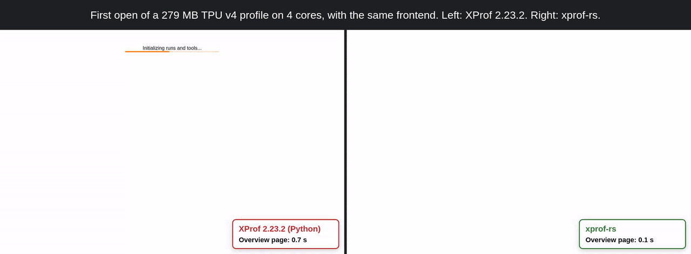
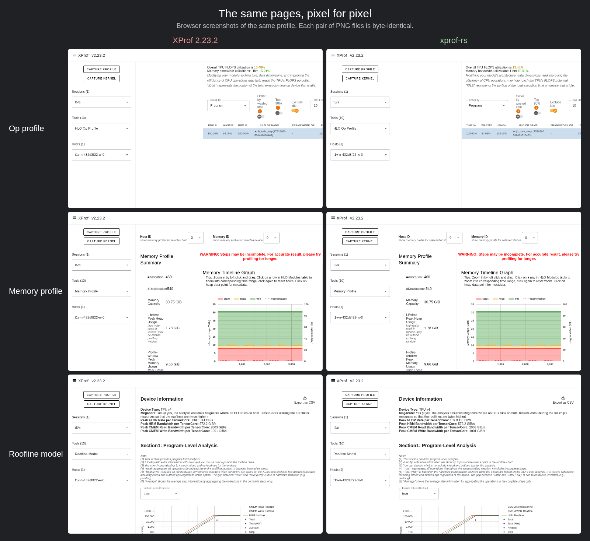

# xprof-rs

[](https://crates.io/crates/xprof-rs)
[](https://github.com/Locamage/xprof-rs/actions/workflows/ci.yml)
[](LICENSE)

xprof-rs is a fast backend for the [XProf](https://github.com/openxla/xprof) profile viewer. It is one Rust binary. It replaces the XProf server and the XProf agent CLI, and it serves the same user interface. Its responses are the same as the responses of XProf 2.23.2. The tests compare them with the output of XProf.

xprof-rs is an independent project. Google and the OpenXLA project do not maintain or endorse it.

We wrote xprof-rs with [Claude](https://www.anthropic.com/claude), an AI model from Anthropic. The tests compare the output of each tool with the output of XProf 2.23.2.

On an 80 MB TPU v4 profile of a job that trains a CLIP model, the trace viewer opens in 0.37 s (XProf: 5.3 s). After the first request, it opens in approximately 2 ms (XProf: 0.62 s). The [performance](#performance) section has the times of all tools.



In the video, the two servers use 4 cores and the same frontend. The times in the video include the time of the browser.

We measured all times in this file with 4 cores of a larger machine, unless the text gives a different number of cores.

XProf converts the `.xplane.pb` file again for each cold request. xprof-rs does these steps:

1. It reads the file into memory.
2. It converts the events in parallel.
3. It keeps the result in a cache.
4. It renders only the time window that you zoom to. A new window takes about 10 ms, and the same window again takes about 3 ms.

## Performance

The tables show the times on an 80 MB TPU v4 profile of a job that trains a CLIP model. Each server and each CLI process used 4 cores.

- Server, cold: the first request to a new server on a new copy of the profile. There is no cache on the disk.
- Server, warm: the mean of 5 more requests to the same server.
- CLI, cold: one process on a new copy of the profile, with no result cache.
- CLI, warm: the same command again.

Each cell is the mean and the standard deviation of 8 trials, after 1 warmup trial that is not counted, as in pyperf. The trials of XProf and xprof-rs alternate, so a change of the machine load affects the two the same. The mark (!) shows a standard deviation of more than 10% of the mean.

| Tool | XProf, cold | xprof-rs, cold | Speed-up | XProf, warm | xprof-rs, warm | Speed-up |
|---|---|---|---|---|---|---|
| `trace_viewer@` | 5.62 ± 0.06 s | 376 ± 14 ms | 15× | 621 ± 1 ms | 2.01 ± 0.07 ms | 310× |
| `overview_page` | 3.94 ± 0.02 s | 238 ± 4 ms | 17× | 57.5 ± 1.4 ms | 0.455 ± 0.025 ms | 126× |
| `op_profile` | 4.43 ± 0.02 s | 259 ± 6 ms | 17× | 571 ± 2 ms | 0.675 ± 0.040 ms | 846× |
| `hlo_stats` | 4.05 ± 0.01 s | 246 ± 6 ms | 16× | 179 ± 2 ms | 0.513 ± 0.032 ms | 348× |
| `framework_op_stats` | 3.98 ± 0.02 s | 244 ± 8 ms | 16× | 99.6 ± 1.5 ms | 0.442 ± 0.033 ms | 225× |
| `input_pipeline_analyzer` | 3.93 ± 0.02 s | 238 ± 5 ms | 17× | 56.1 ± 1.5 ms | 0.447 ± 0.037 ms | 126× |
| `roofline_model` | 4.12 ± 0.01 s | 253 ± 4 ms | 16× | 270 ± 1 ms | 0.567 ± 0.035 ms | 476× |
| `memory_profile` | 1.70 ± 0.01 s | 125 ± 1 ms | 14× | 1.55 ± 0.01 s | 0.446 ± 0.032 ms | 3487× |
| `pod_viewer` | 3.92 ± 0.01 s | 234 ± 3 ms | 17× | 55.7 ± 0.2 ms | 0.441 ± 0.031 ms | 126× |
| `memory_viewer` | 85.9 ± 0.2 ms | 21.7 ± 0.7 ms | 4.0× | 79.9 ± 0.1 ms | 0.389 ± 0.027 ms | 205× |

| Command | XProf, cold | xprof-rs, cold | Speed-up | XProf, warm | xprof-rs, warm | Speed-up |
|---|---|---|---|---|---|---|
| `get_overview` | 4.22 ± 0.01 s | 239 ± 13 ms | 18× | 226 ± 1 ms | 234 ± 10 ms | 1.0× |
| `get_top_hlo_ops` | 5.47 ± 0.01 s | 138 ± 2 ms | 40× | 227 ± 1 ms | 137 ± 2 ms | 1.7× |
| `get_hlo_op_profile` | 5.48 ± 0.02 s | 141 ± 8 ms | 39× | 230 ± 2 ms | 136 ± 4 ms | 1.7× |
| `get_hlo_stats` | 4.14 ± 0.02 s | 110 ± 2 ms | 38× | 227 ± 1 ms | 107 ± 3 ms | 2.1× |
| `get_roofline_model` | 4.24 ± 0.01 s | 214 ± 6 ms | 20× | 227 ± 1 ms | 210 ± 2 ms | 1.1× |
| `get_step_trace` | 4.08 ± 0.02 s | 230 ± 3 ms | 18× | 226 ± 1 ms | 228 ± 2 ms | 1.0× |
| `check_host_boundness` | 67.6 ± 0.3 s | 293 ± 8 ms | 231× | 227 ± 1 ms | 293 ± 9 ms | 0.8× |
| `get_memory_profile` | 1.84 ± 0.00 s | 137 ± 2 ms | 13× | 226 ± 2 ms | 134 ± 2 ms | 1.7× |
| `list_hlo_modules` | 226 ± 3 ms | 5.81 ± 0.25 ms | 39× | 225 ± 1 ms | 5.27 ± 0.17 ms | 43× |
| `aggregate_xplane_events` | 22.0 ± 0.1 s | 117 ± 2 ms | 188× | 244 ± 5 ms | 113 ± 1 ms | 2.2× |
| `compute_utilization` | 3.11 ± 0.01 s | 46.8 ± 0.6 ms | 67× | 226 ± 1 ms | 45.6 ± 0.3 ms | 5.0× |
| `get_avg_step_time` | 1.35 ± 0.00 s | 53.1 ± 2.5 ms | 25× | 226 ± 1 ms | 50.3 ± 0.9 ms | 4.5× |
| `get_device_information` | 4.18 ± 0.01 s | 190 ± 3 ms | 22× | 226 ± 1 ms | 188 ± 5 ms | 1.2× |
| `get_graph_viewer` | 342 ± 1 ms | 32.3 ± 0.9 ms | 11× | 342 ± 1 ms | 32.3 ± 0.7 ms | 11× |
| `get_hlo_module_content` | 349 ± 2 ms | 33.2 ± 1.4 ms | 10× | 227 ± 1 ms | 32.5 ± 0.7 ms | 7.0× |
| `get_hlo_text` | 349 ± 1 ms | 32.7 ± 0.6 ms | 11× | 228 ± 1 ms | 32.9 ± 1.0 ms | 6.9× |
| `get_hosts` | 225 ± 1 ms | 5.77 ± 0.31 ms | 39× | 225 ± 1 ms | 5.35 ± 0.14 ms | 42× |
| `get_kernel_stats` | 11.9 ± 0.0 s | 72.4 ± 2.6 ms | 165× | 226 ± 1 ms | 71.0 ± 2.8 ms | 3.2× |
| `get_kernel_utilization` | 3.11 ± 0.01 s | 46.5 ± 0.5 ms | 67× | 226 ± 1 ms | 45.4 ± 0.4 ms | 5.0× |
| `get_kpi_metrics` | 5.44 ± 0.01 s | 252 ± 3 ms | 22× | 228 ± 1 ms | 253 ± 4 ms | 0.9× |
| `get_llo_analysis` | 1.31 ± 0.00 s | 6.13 ± 0.20 ms | 213× | 1.30 ± 0.00 s | 5.27 ± 0.27 ms | 247× |
| `get_llo_debug_string` | 1.30 ± 0.01 s | 5.99 ± 0.17 ms | 217× | 1.30 ± 0.00 s | 5.32 ± 0.26 ms | 245× |
| `get_peak_allocations` | 301 ± 1 ms | 28.3 ± 0.5 ms | 11× | 226 ± 1 ms | 28.5 ± 0.4 ms | 7.9× |
| `get_profile_summary` | 5.45 ± 0.01 s | 131 ± 3 ms | 42× | 226 ± 1 ms | 129 ± 3 ms | 1.8× |
| `get_utilization_viewer` | 2.19 ± 0.01 s | 46.9 ± 0.6 ms | 47× | 226 ± 1 ms | 45.4 ± 0.5 ms | 5.0× |
| `get_xspace_proto` | 354 ± 3 ms | 83.8 ± 1.4 ms | 4.2× | 799 ± 46 ms | 100 ± 3 ms | 8.0× |
| `list_xplane_events` | 22.0 ± 0.0 s | 81.9 ± 1.1 ms | 269× | 226 ± 1 ms | 78.4 ± 1.5 ms | 2.9× |

Some warm XProf commands are as fast as xprof-rs or faster. XProf keeps each result in a cache in `$TMPDIR`, and a second call reads this cache. xprof-rs has no result cache. It reads the profile again for each call.

The table has all the commands that need only a session. `get_hlo_neighborhood`, `verify_numerical_parity`, and `upload_trace` need more input, so the table does not show them. `get_xspace_proto` writes the 80 MB profile to `/tmp` on a disk. On a warm call, XProf writes over the file of the cold call, and the write waits until the disk has the data.

The next table shows five profiles of jobs that train CLIP models. The trace viewer time is for a cold server. The peak memory is the peak of the server process after the trace viewer and seven other tools.

| Profile | XProf, trace viewer | xprof-rs, trace viewer | XProf, peak memory | xprof-rs, peak memory |
|---|---|---|---|---|
| 43 MB | 3.0 s | 186 ms | 1.21 GB | 0.43 GB |
| 43 MB | 2.6 s | 195 ms | 1.23 GB | 0.44 GB |
| 52 MB | 3.4 s | 295 ms | 1.50 GB | 0.57 GB |
| 80 MB | 6.0 s | 453 ms | 2.09 GB | 0.75 GB |
| 117 MB | 8.1 s | 678 ms | 3.09 GB | 1.05 GB |

These numbers are for the 80 MB profile:

| Item | XProf | xprof-rs |
|---|---|---|
| Trace viewer, zoom to a new time window | 95 ms | 1.9 ms |
| Trace viewer, the same window again | 88 ms | 0.3 ms |
| Server start, until the first response | 0.41 s | 0.05 s |
| Size of the installed files | 127 MB (Python packages, without Python) | 27 MB (one binary) |
| Size of the download | 52 Python packages | 12.6 MB archive |

More cores make xprof-rs faster. The next table shows the cold times of xprof-rs on the 80 MB profile. XProf on 4 cores takes 5.4 s for the trace viewer and 3.9 s for the overview page.

| Cores | Trace viewer | Overview page | Peak memory |
|---|---|---|---|
| 1 | 1.04 s | 0.89 s | 0.62 GB |
| 2 | 0.61 s | 0.47 s | 0.65 GB |
| 4 | 0.40 s | 0.28 s | 0.69 GB |
| 8 | 0.32 s | 0.18 s | 0.76 GB |
| 16 | 0.36 s | 0.16 s | 0.79 GB |
| 32 | 0.36 s | 0.16 s | 0.81 GB |
| 64 | 0.35 s | 0.14 s | 0.80 GB |

To measure the times of the first two tables on your profile, run [`examples/benchmark.py`](examples/benchmark.py) `SESSION_DIR --xprof PATH --cores 0-3 --trials 8`.

## Install and start

The [releases](https://github.com/Locamage/xprof-rs/releases) have binaries for Linux on `x86_64` and `aarch64`, and for macOS on Apple silicon. The Linux binaries need glibc 2.28 or newer (RHEL 8, Debian 10, Ubuntu 20.04, or newer). You do not need Python.

```bash
version=v0.1.3 target=x86_64-linux   # or aarch64-linux, aarch64-macos
curl -LO https://github.com/Locamage/xprof-rs/releases/download/$version/xprof-rs-$version-$target.tar.gz
tar -xzf xprof-rs-$version-$target.tar.gz
xprof-rs-$version-$target/xprof-rs --logdir ~/logs          # open http://localhost:8791
xprof-rs-$version-$target/xprof-rs get_overview ~/logs/run1 # the same binary runs the XProf agent CLI
```

To build from source, you need Rust 1.95 or newer, a C compiler, and a 64-bit Unix system. You do not need a C++ toolchain or `protoc`.

```bash
cargo install --locked xprof-rs
```

The release profile uses fat LTO and one codegen unit. A full build takes about 80 s on a machine with 240 cores. It uses about 10 CPU minutes. On 8 cores, it takes about 2 minutes. For a quick build, set `CARGO_PROFILE_RELEASE_LTO=false` and `CARGO_PROFILE_RELEASE_CODEGEN_UNITS=16`.

## Server

```bash
xprof-rs [--logdir DIR|URL] [--port 8791] [--host ADDRESS] [--src_prefix PREFIX] [--hide_capture_profile_button] [--enable_tab_name_label]
```

- The user interface is the prebuilt frontend of the XProf 2.23.2 Python package. It uses the Apache License 2.0. The copyright holder is The TensorFlow Authors.
- The binary includes the files from `ui/`. To serve other files, set `XPROF_STATIC_DIR` to a directory.
- Each route answers at the root and under `/data/plugin/profile`.
- The server listens on `127.0.0.1` port 8791. There is no authentication. To let other computers connect, use `--host 0.0.0.0` (all IPv4 interfaces) or `--host ::` (all interfaces). XProf listens on all interfaces.
- With `--logdir`, a request can read only the files in the log directory.
- A `run`, `session_path`, or `module_name` that points outside the log directory gets a 400 response.
- The directory walk does not follow symbolic links to directories.
- Without `--logdir`, the server lists no runs. A `session_path` or `run_path` request can still open a directory.
- The server accepts `--grpc_port`, `--worker_service_address`, and `--max_concurrent_worker_requests`. It does not use them.

The server has these tools. They are all written in Rust.

- Trace viewer: `trace_viewer@` (zoom, search, details, DMA, `format=pb`) and `trace_viewer`.
- Statistics: `overview_page`, `op_profile`, `hlo_stats`, `framework_op_stats`, `input_pipeline_analyzer`, `roofline_model`, `kernel_stats`, `inference_profile`.
- Memory and graphs: `memory_profile`, `memory_viewer`, `graph_viewer`, `module_list`.
- Hardware: `pod_viewer`, `megascale_stats`, `smart_suggestion`, `perf_counters`, `utilization_viewer`, `kernel_utilization`.
- Session: `runs`, `run_tools`, `hosts`, `data_csv`, `version`, `config`, `POST /generate_cache`, `/capture_profile` (gRPC client), and the static files.

The pages are the same as the pages of XProf. In this image, each pair of browser screenshots is byte-identical.



A machine with more cores uses more memory, because more work runs at the same time.

## Remote log directories

`--logdir` accepts these URL schemes: `gs://`, `s3://` (also S3-compatible stores), `az://`, `abfs://`, `http(s)://` (WebDAV), and `file://`. The [`object_store`](https://crates.io/crates/object_store) crate does the access.

The credentials come from the environment:

- `gs://`: `GOOGLE_APPLICATION_CREDENTIALS` or the application default credentials.
- S3: the `AWS_*` variables.
- Azure: the `AZURE_*` variables.

The server copies the store to a local directory, and all tools read this copy. The directory is `xprof-rs-<hash of the URL>` in `XPROF_CACHE_DIR`. The default is the temporary directory. Only the user of the server can read the directory. The server does not start if a different user owns it.

- A request that names a session downloads the `.xplane.pb` and `.hlo_proto.pb` files of the session.
- The server downloads 4 files at a time. It reads each file in eight ranges of 8 MiB.
- The server does not download a file again when the size and the modification time are the same as in the store.
- The server asks the store at most one time in 5 s for each session.
- Each 30 s, a background poll checks the list of sessions. It also checks the 8 sessions with the newest requests.
- If the copy is larger than `XPROF_CACHE_BYTES`, the server removes sessions. The default is 20 GiB. The server removes the session with the oldest request first. It keeps a session with a request in the last minute.
- If the store is not reachable, the response is 502 with the error of the store. The response is the same for credentials that are not correct. A list request stops after 30 s.
- The server does not write to the store. There is one exception. `/capture_profile` uploads the captured files to `<URL>/plugins/profile/<session>/`.

Set the URL to the directory that holds the profiles. The server visits each directory under it.

### Times on a disk and on R2

XProf 2.23.2 does not read `s3://` URLs. Its server and its file code know only `gs://` and local paths. To read R2, XProf needs a FUSE mount of the bucket, for example `rclone mount`. xprof-rs can read R2 through the `s3://` URL or through the mount.

The next tables show the cold times of a new server with 4 cores, from the start of the process to the end of the first response.

- tmpfs: the files are in memory.
- Disk: the persistent disk of a cloud VM. Before each trial, the page cache did not have the files.
- R2 mount: a new `rclone mount --vfs-cache-mode writes` of Cloudflare R2 for each trial. XProf writes its cache files into the session directory, so the mount must accept writes.
- R2: xprof-rs reads the `s3://` URL. Before each trial, the cache directory was empty.

Before each trial, we removed the files that the servers wrote. Each cell is the mean of 3 trials on the 80 MB profile and of 2 trials on the 279 MB profile.

80 MB profile:

| Tool | XProf, tmpfs | xprof-rs, tmpfs | XProf, disk | xprof-rs, disk | XProf, R2 mount | xprof-rs, R2 mount | xprof-rs, R2 |
|---|---|---|---|---|---|---|---|
| Trace viewer | 5.71 s | 0.46 s | 7.33 s | 1.48 s | 7.32 s | 2.40 s | 1.77 s |
| Overview page | 4.31 s | 0.26 s | 5.79 s | 1.11 s | 6.06 s | 3.49 s | 1.45 s |
| Op profile | 4.83 s | 0.32 s | 6.27 s | 0.81 s | 6.34 s | 2.72 s | 1.43 s |
| HLO op stats | 4.41 s | 0.28 s | 5.93 s | 1.21 s | 5.92 s | 4.64 s | 1.80 s |
| Framework op stats | 4.31 s | 0.27 s | 5.75 s | 0.79 s | 5.84 s | 2.25 s | 1.57 s |
| Input pipeline | 4.26 s | 0.26 s | 5.88 s | 0.74 s | 6.92 s | 2.58 s | 1.37 s |
| Roofline model | 4.49 s | 0.29 s | 6.00 s | 0.78 s | 6.14 s | 2.52 s | 1.45 s |
| Memory profile | 2.09 s | 0.16 s | 3.71 s | 0.83 s | 4.31 s | 2.01 s | 1.47 s |
| Pod viewer | 4.32 s | 0.26 s | 5.90 s | 0.75 s | 6.38 s | 2.38 s | 1.44 s |
| Memory viewer | 0.46 s | 0.05 s | 0.58 s | 0.11 s | 1.52 s | 1.00 s | 1.15 s |

279 MB profile:

| Tool | XProf, tmpfs | xprof-rs, tmpfs | XProf, disk | xprof-rs, disk | XProf, R2 mount | xprof-rs, R2 mount | xprof-rs, R2 |
|---|---|---|---|---|---|---|---|
| Trace viewer | 14.7 s | 0.84 s | 18.0 s | 3.51 s | 20.0 s | 7.76 s | 3.02 s |
| Overview page | 21.3 s | 1.05 s | 25.2 s | 3.30 s | 24.9 s | 5.81 s | 3.47 s |
| Op profile | 27.3 s | 1.29 s | 31.0 s | 3.59 s | 33.5 s | 5.56 s | 2.97 s |
| HLO op stats | 23.2 s | 1.21 s | 26.4 s | 3.56 s | 28.8 s | 4.73 s | 3.29 s |
| Framework op stats | 21.3 s | 1.03 s | 24.8 s | 3.34 s | 24.2 s | 7.02 s | 2.83 s |
| Input pipeline | 21.3 s | 1.01 s | 24.6 s | 3.27 s | 25.4 s | 8.37 s | 2.71 s |
| Roofline model | 21.6 s | 1.06 s | 25.0 s | 3.33 s | 25.2 s | 7.12 s | 2.90 s |
| Memory profile | 3.88 s | 0.28 s | 7.18 s | 2.61 s | 7.89 s | 6.62 s | 1.96 s |
| Pod viewer | 21.3 s | 1.05 s | 24.7 s | 3.27 s | 26.6 s | 6.14 s | 2.70 s |
| Memory viewer | 2.06 s | 0.33 s | 2.53 s | 1.17 s | 3.16 s | 1.84 s | 2.09 s |

- After the first request, xprof-rs answers in 0.4 ms to 6 ms from all sources. XProf answers in 55 ms to 2.2 s on the 80 MB profile and in 0.6 s to 6.9 s on the 279 MB profile.
- The responses of xprof-rs were the same for all sources. For 5 tools, the bytes of XProf change from one process to the next: the order of map keys and of equal items, and the `bind_id` values of the trace viewer. Without these changes, the responses of XProf and xprof-rs have the same data.
- The disk gave approximately 150 MB/s. This is the limit of the disk, and it changes with the load of the disk.
- A read through `rclone mount` is approximately 46 MB/s, because the mount reads a file in order with one stream. On a FUSE mount, xprof-rs reads each file in order. On other file systems, it reads parts of the file in parallel.
- With the `s3://` URL, the first list of the store takes approximately 0.3 s. The download is approximately 210 MB/s, approximately the same as `rclone` with 8 to 32 streams. The server downloads all the files of the session, also for the memory viewer, which needs only the HLO file.
- The R2 times change with the network. One XProf trial of the op profile on the mount took 149 s, and we measured it again.
- When the server starts again with the same cache directory, it does not download the files again. The first overview page of the 279 MB profile then takes 1.05 s.

## Command line

Use `xprof-rs <command> <session> [--flag=value ...]` to run the agent CLI of XProf. The stdout and the exit codes are the same as in XProf 2.23.2.

The session is one of these:

- a run directory
- a log directory (the CLI uses the latest run)
- an `.xplane.pb` file
- a run name, with `--logdir`

The flags follow XProf (Python Fire):

- `--name=value` and `--name value`
- `--name` and `--noname` for booleans
- positional parameters in the order of XProf
- the aliases `--session_dir`, `--session_path`, and `--source`

An error prints `{"status": "ERROR", "reason": ...}`. The exit code is 2 (usage), 3 (path), 4 (value not valid), or 1 (internal). A result larger than 10 MB goes to a file in `$TMPDIR`. This is the same as in XProf.

The commands are:

- Summary: `get_overview`, `get_kpi_metrics`, `get_device_information`, `get_hosts`, `get_profile_summary`, `get_avg_step_time`, `get_step_trace`, `check_host_boundness`.
- Operations: `get_roofline_model`, `get_top_hlo_ops`, `get_hlo_op_profile`, `get_hlo_stats`, `get_kernel_stats`.
- Memory: `get_memory_profile`, `get_peak_allocations`.
- HLO: `list_hlo_modules`, `get_hlo_module_content`, `get_hlo_neighborhood`, `get_hlo_text`, `get_graph_viewer`.
- Utilization: `get_utilization_viewer`, `get_kernel_utilization`, `compute_utilization`.
- Events and files: `list_xplane_events`, `aggregate_xplane_events`, `get_xspace_proto`, `upload_trace`.
- Not available: `get_llo_analysis`, `get_llo_debug_string`, `verify_numerical_parity`.

The flags of each command are the flags of XProf. Examples:

```bash
xprof-rs get_top_hlo_ops ~/logs/run1 --limit=5 --category_filter=fusion
xprof-rs get_hlo_op_profile ~/logs --view=tree --path=by_program --depth=3
xprof-rs list_xplane_events ~/logs/run1 --plane_regex='TPU:0$' --event_regex=all-reduce --max_events=20
```

More cores make a command faster, up to about 16 cores.

The CLI is different from the Python CLI in these points:

- There is no result cache. Each call computes the result again, as with `--bypass_cache`. There are no `__cached__` fields.
- Regex errors are the errors of Rust.
- `--help` prints a short synopsis.
- `get_graph_viewer --output_type=pb` returns the bytes of the module file. XProf serializes the module again with hash-ordered maps.
- For a multi-host session, the tools that use combined op statistics report no data. `memory_profile` fails. XProf needs its worker service for these sessions.

## Not available and not supported

xprof-rs replaces the backend. It does not replace the complete XProf distribution.

**Inputs**

- xprof-rs does not read `.xplane.riegeli` sessions. The continuous capture mode of the gRPC client is the only source of these files. The `jax.profiler.start_trace` function writes `.xplane.pb`. MaxText, Levanter, and marin use this function.
- xprof-rs rejects a profile of 4 GiB or more. A profile file is one protobuf message, and protobuf limits a message to 2 GiB. Thus XProf cannot read a profile of 2 GiB or more.

**Server**

- There is no distributed worker mode. There is no worker gRPC service. `/capture_profile` is a client.
- There is no TLS. There is no authentication. There is no TensorBoard plugin loader.
- xprof-rs runs on 64-bit Unix. CI tests Linux on x86_64 and aarch64, and macOS on Apple silicon. There is no Windows build.

**Tools**

- `get_llo_analysis` and `get_llo_debug_string` return the LLO-not-available report of XProf. The source code of the LLO analysis is not public.
- `verify_numerical_parity` returns the error of XProf for dependencies that are not installed. XProf runs Python callables for this command.
- The `detect_*` commands from the README of XProf are not available. XProf 2.23.2 does not register them.
- `mpmd_pipeline_view=true` has no effect. XProf has the same behavior.
- `perf_counters` with `names_only` and `utilization_viewer` support only TPU v6e and v7x. XProf 2.23.2 has counter tables only for these two chips. The tables are in `src/data/`.

**Python part of the XProf package**

- These parts are not available: `xprof.convert`, the `ProfileData` library, the `xprof.api` snapshot client, `install_and_run.py`, the labs, and the agent skills.

**Frontend**

- This repository does not contain the sources of the user interface.

**Output that changes from run to run in XProf**

xprof-rs cannot copy these outputs.

- The order of tied rows in `hlo_stats`, `op_profile`, `memory_viewer`, and `get_peak_allocations`. XProf uses hash order. The seed changes for each process. A node of `op_profile` shows at most 100 children. When children have the same time, the tie order selects the children that show. The category sums of `get_hlo_op_profile` add the children that show, so these sums can also change.
- The order of processes and threads in the protobuf.
- The allocator peaks and the fragmentation snapshot of the memory profile.
- The `bind_id` flow ids of the trace viewer.
- The order of the `stackFrames` entries of the trace viewer. XProf writes them in hash order.
- The graph node ids. They are heap pointers.
- The hover CSS rules and the caller lists of the graph viewer.
- The `Launch Stats` line of a GPU device. XProf writes it in hash order. The `uid` of host events at the same timestamp can differ.
- The statistics of a multi-host session. XProf caches the first op statistics under `ALL_HOSTS`. It sometimes leaves the duty cycle at 0. xprof-rs answers each host selection as a new XProf process does.
- The tensor pattern rows of `inference_profile`.
- The order of requests with equal latency in `inference_profile`.
- The order of the sums in the latency averages.

## Test coverage

- `tests/data` has a demo trace. It is a small synthetic workload on a TPU v4-8. We replaced the host name, the script path, and the host system information.
- `tests/data` also has the outputs of XProf for the demo trace. It has synthetic GPU profiles and HLO fixtures in `tests/data/gpu`.
- `cargo test` compares each tool and the trace viewer with these outputs.
- Other tests used TPU v4 and v6e traces and one 8-GPU trace. They also used synthetic sessions of 2, 4, and 8 hosts.
- The synthetic GPU sessions use 1, 2, or 8 GPUs from NVIDIA or AMD. They cover TensorFlow, JAX, eager steps, NCCL, and CUDA graphs.
- The synthetic inference sessions cover TensorFlow, request batches, TFRT, Pathways, and Orbax. No real inference profile was available.
- These traces are not in the repository.
- The real-world coverage is small. If a response is different from XProf 2.23.2, open an issue. Do not include private data.
- To report a security problem, follow `SECURITY.md`. Do not open a public issue.

## Memory

- Three LRU caches hold converted traces, op statistics, and rendered responses (compressed). Each of the first two holds an eighth of the physical memory, at most 4 GiB. The third holds a quarter of that. On a machine with 32 GiB or more, the total is about 9 GiB.
- The server loads 2 files at once on a machine with 32 GiB or more, and 1 file otherwise. A load needs about four to six times the size of its file. More cores need more memory.
- The server and the CLI use one thread per core, at most 32.
- A cache removes an entry after one hour without use.
- A trace that is larger than its cache is still served. The server caches it alone.
- The server loads a file again when the size, the modification time, or the inode changes. It does not cache a file that changed in the last 2 s.
- A background task loads the 8 newest sessions at startup and when a session changes. It loads only the files that did not change for 30 s and that are smaller than a thirty-second of the physical memory. This task keeps about 0.7 GB more in memory for a 279 MB trace.
- A session of 4 hosts has 279 MB v4 traces. The trace viewer of all hosts takes 1.8 s. `overview_page` takes 3.8 s and a peak of 4.5 GB.
- For 8 hosts, the times are 3.8 s and 5.2 s. The peak is 7.6 GB.

## Development

Run these commands before each commit. `Cargo.toml` turns on the pedantic lints of clippy.

```bash
cargo fmt --check
cargo clippy --release --all-targets -- -D warnings
cargo test --release
```

A tag that starts with `v` makes a draft release with `x86_64-linux`, `aarch64-linux`, and `aarch64-macos` archives and SHA-256 files. The steps are in `RELEASING.md`.

The code is in `src/`:

- `main.rs`: flags, routes, and caches.
- `xplane/`: the `.xplane.pb` reader, derived lines, event groups, and steps.
- `trace/`: the trace viewer conversion and its JSON and protobuf output.
- `hlo/`: the HLO module, its text form, the GPU cost model, the graph viewer, and the memory viewer.
- `tools/`: one module for each other tool.
- `server/`: object stores, profile capture, and the tool list of a run.
- `cli/`: the agent CLI.
- `data/`: the protobuf descriptors, the TPU counter tables, and the HTML page of the graph viewer.
- `tests/`: tests from XProf and XLA. `tests/inline/` has the unit tests of the modules, in the same folders.

## License

Apache-2.0. The algorithms follow Apache-licensed code from [OpenXLA XProf](https://github.com/openxla/xprof) and [XLA/TSL](https://github.com/openxla/xla). See `NOTICE`.
